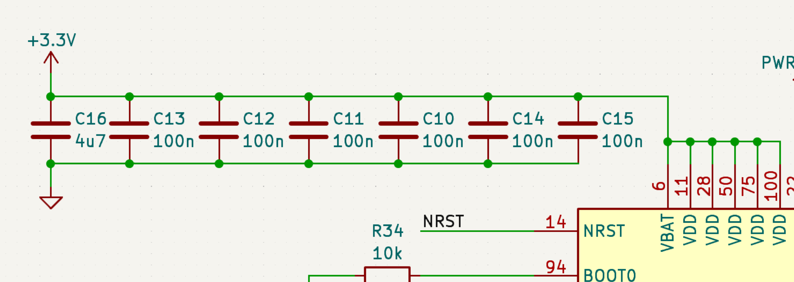

# Clayton's notes on the Flight Computer

## Schematics

### General notes

I like the hierarchical schematics. Remember that you're not paying by the page - I'd recommend breaking things up into their own pages whenever appropriate.

Stylistically, I prefer to avoid using named wires for connections when possible because it's harder to read.

STM32 should probably be on its own page to reduce clutter.

PLEASE put together a BOM NOW! And also keep it as a "living" document - I suggest version controlling it with the design. Make sure to include columns for the JLC part number and whether JLC has it in stock; maybe even include columns for substitutes if possible. If JLC has fewer than 10 of a part in stock, it might as well not exist.

I really hope you're not assembling this PCB by hand.

Strongly recommend making a design overview doc that explains decisions and gives an overview of project goals, requirements, and what you found.

A lot of this stuff is high-speed - double- and triple- check your work. 

I strongly recommend buying breadboard versions of all your ICs, assembling them according to your schematic, and then debugging with it so that you don't fabricate an incorrect PCB or have to use a PCB designed for a shit chip. **It will save you time in the long run.**

What battery are you using? Make sure to do calculations on battery capacity and current budget, then make sure the battery lifetime is an order of magnitude larger than your expectation.

Is it at all possible to select different ICs so that you don't need to have 3 different kinds of buses? Ideally, you would get away with just one (probably SPI).

If you don't know why you're using the magnetometer, cut it out. Straight up. No mercy.

### Processor setup

Connecting all the decoupling caps together shows poor design intent here.
Same story on some of the other hardware.

### Pyrotechnics

Put the external connector for pyrotechnics on the same schematic.

Add a flyback diode to output to prevent inductive loads from killing things.

Add status indicator LEDs to the pyrotechnics so that you never connect a hot line and can debug just by looking.

Add a pulldown resistor to the gate on the pyrotechnics so that they always fail to "off."

Continuity voltages should probably be outputs, not inputs.

### Connectors

I strongly recommend adding fuses (I love the replaceable automotive ones) to external power whenever possible. It helps a lot with resilience and can prevent your board from becoming a piece of toast.

In fact, add a fuse to any external connections where possible.

Add reverse-biased diodes on +V and GND to all external connectors to prevent over- or under-volting on the ICs.

### Power

I want to see a status LED on everything. 
I mean EVERYTHING.
If you put a transistor on the I2C and SPI buses, you can even have an LED for bus activity (great for debugging).

Definitely need flyback and anti-reverse-bias diodes on all your power hardware.

## Board layout

I recommend adding a ground fill on the top and bottom planes as well if you can. 

USB runs pretty fast - make sure to do some analysis on how wide your traces can be and how sharply they can twist. Parasitic inductance and cross-talk are no joke.

Are you under severe space constraints? If not, make the board larger, use bigger components (so you can re-solder them if needed. I recommend SOIC) and give yourself a little room to work.

I'm a big 3D model enjoyer because it helps a lot with visualization and space claiming. See if you can track down models for more components and include them in your library.
