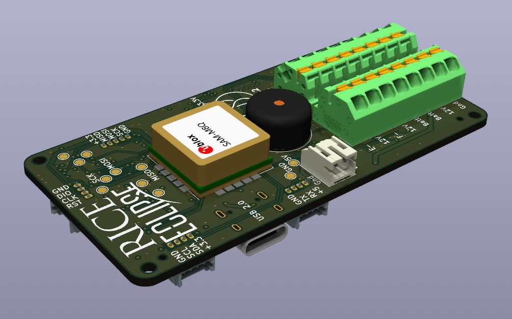
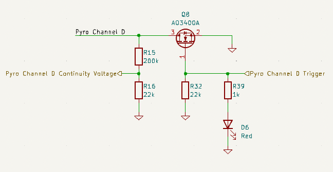
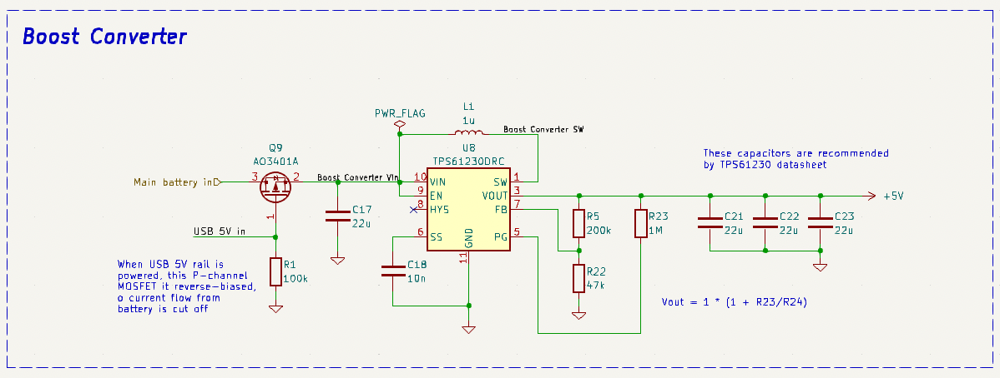
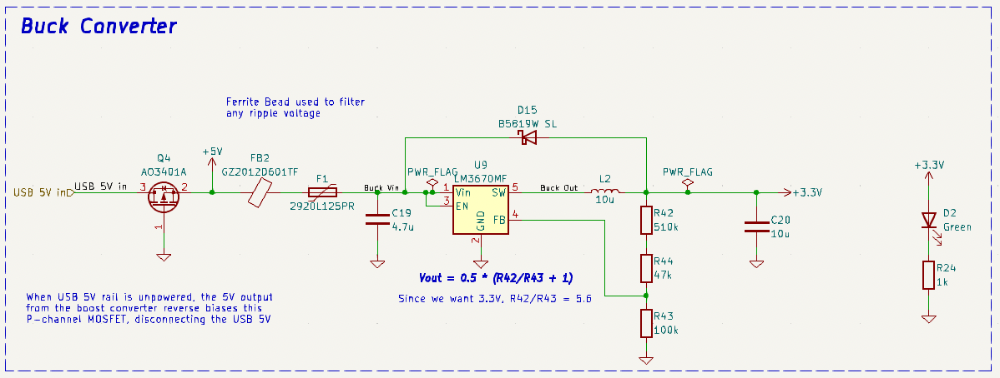
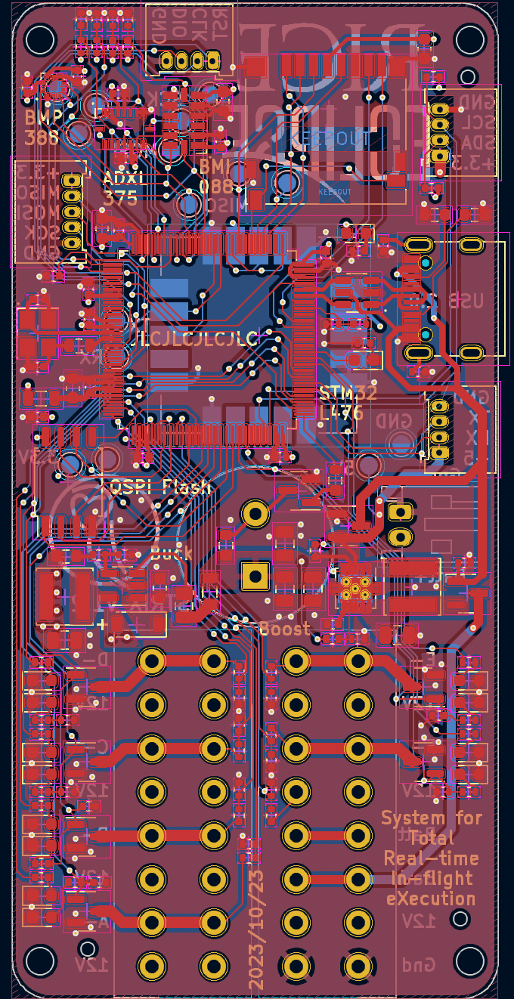
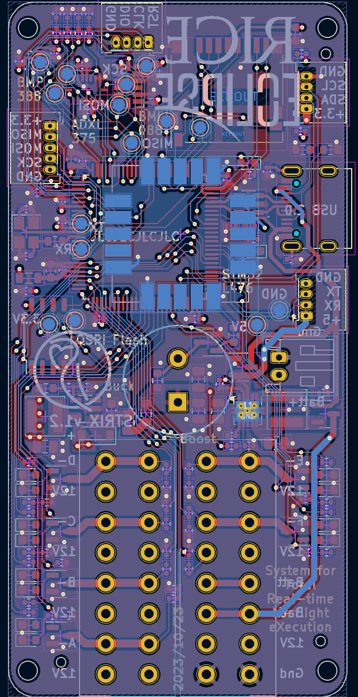
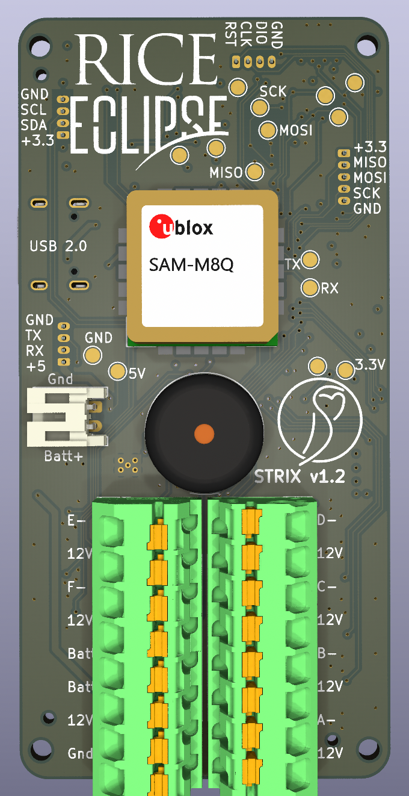
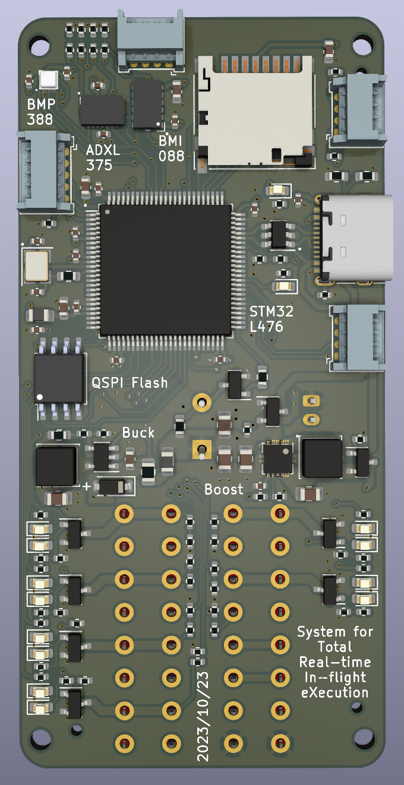

# Strix

Strix is a completely student researched and designed flight computer. It was created to record data, transmit telemetry, and control in-flight events in Eclipse's rockets. It is intended to supplement/replace altimeters and flight computers Eclipse currently uses, including the Missileworks RRC2+, Featherweight Altimeters Raven Blue, and Altus Metrum TeleMega.

## Requirements

Strix was designed with several requirements in mind. It must:

1. Read linear and angular acceleration data from two different accelerometers
2. Read barometric altitude
3. Record data to flash memory and/or a MicroSD card
4. Perform sensor fusion to obtain an accurate estimate of a rocket's location
5. Control in-flight events using pyrotechnic charges and igniters

## Schematics

The design of Strix is split up into sections, each occupying a separate hierarchical sheet in the KiCAD project. These sections are the **Microcontroller, Pyrotechnic Charges, Sensors and Data Storage, Connectors, and Power Supply**.

### Microcontroller

### Pyrotechnic Charges

Each pyrotechnic charge is actuated by an A03400A N-channel MOSFET. This is triggered by a GPIO output pin on the Microcontroller, along with an indicator LED to notify when a channel is active. The Pyrotechnic charge itself is attached to the +12V rail, representing the ignition battery positive voltage, and the - channel on the terminal block. This is then connected through a high impedance voltage divider to ground, to enable the microcontroller to read the voltage through this voltage divider and determine if there is continuity on the charge.

The terminal blocks for the pyrotechnic charges were chosen to provide an upgrade to the traiditionally used screw switches. Screw switches require using solid-core wire to avoid wires falling out due to vibrations in flight of the rocket, while terminal blocks like the Pheonix Contact 1861991 provide spring-loaded pressure that functions equally well with stranded core as well as solid core wire. Another reason these were chosen is the ease of swapping out wires into these lever nuts is another benefit of this choice.

### Sensors and Data Storage

The sensors used on this board are as follows:

- Bosch **BMI088** ruggedized accelerometer measuring $\pm$ 16 Gs
  - This is Bosch's accelerometer designed specifically for robotics and drone applications, and advertises high resistance to vibrations.
- Analog Devices **ADXL375** High-G accelerometer reading $\pm$ 64 Gs
- Bosch **BMP388** barometric pressure sensor
  - This was the second choice after the Measurement Specialties MS5611, but was chosen due to better stock at JLCPCB.
- U-blox **SAM-M10** GNSS receiver
  - This was chosen to provide a drop-in solution for GNSS reception, including an antenna. It increases cost by about $10 over alternatives without included antennas, but the decision was made to ensure GPS functionality.

### Connectors

The connectors were chosen to maximize ease of use and expandability. There are breakouts for external connections to dedicated SPI, I2C, and UART busses through Molex Picoblade connectors. A Molex Picoblade connector is also used for the Serial Wire Debug connection to the STM32 Microcontroller.

The connector schematic sheet contains the expansion ports, battery plug, and USB port, along with associated circuit elements. The USB port is a USB-C port running at USB 2.0 speeds, connected to a **USB-LC6** electrostatic discharge protection chip.

### Power Supply

The power supply was designed to accept either USB bus voltage (between 4.5 and 5.5 volts) or battery voltage between 2 and 5 volts. This is acheived through a two phase boost-buck architecture. The boost converter, a **TPS61230**, first converts from the battery voltage to +5.1 volts, which is then combined with USB power and supplied to an **LM3670** buck converter to regulate down to +3.3 volts to supply the Microcontroller, sensors, flash storage chip, MicroSD card, and other assorted components.

To prioritize the USB input voltage over discharging a connected battery, the power supply makes use of a pair of P-channel MOSFETs, which also protect against reverse polarity battery connections. These are configured such that if the USB Vbus rail is powered, the P-channel mosfet connected to the input of the boost converter is reverse-biased, so does not allow current to flow from the battery input. If the USB Vbus is not powered, the gate of this MOSFET is connected to ground through a 100k Ohm resistor, which forward-biases the MOSFET and allows current to flow. The battery input is thus connected to the TPS61230, and the +5.1V output from this is connected to the LM3670, with a second P-channel MOSFET between this and the USB Vbus rail. The gate of this second P-channel MOSFET is shorted to ground, which only allows current to flow from the Vbus input to the LM3670, and not from the boost converter output back towards the USB connector. This is necessary to prevent the boost converter from turning itself off with its own output.

The surrounding components for both the Boost and Buck converter were chosen according to guidelines in the datasheets for both components.

## Layout

The layout was designed to optimize space consumption, as well as to facilitate ease-of-use and configurability. The expansion SPI, I2C, and UART ports are brought out to the edges of the board, as well as the serial wire debug port. Components are placed on both sides of the board, however all SMD components that can be assembled by JLSBCB are on the back (technically the F.Cu layer in KiCAD). The components left for the front are the Buzzer, GPS module, Main battery JST-PH plug, and terminal blocks for screw switches and Pyrotechnic charges.

### Physical Size

The physical specifications of the board are: PCB 39mm wide by 80mm long. Components extend <3.5mm from the back, and up to 8mm from the front. Mounting holes are uniform distances from the edge of the PCB, and are spaced 33mm x 72mm apart on each corner.

### Test Point Locations

The test points are shown in the diagram below, and labeled in the following table:

